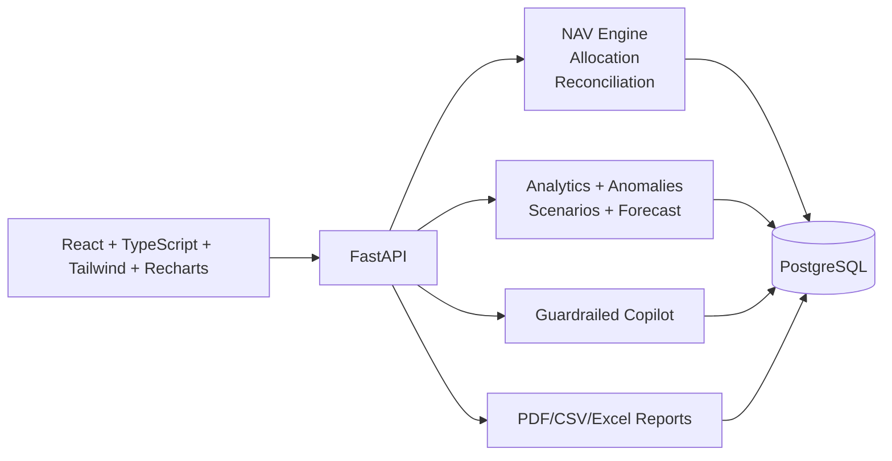

<div align="center">

# NAVCore Platform

**Multi-Club NAV Fund Operating System — Audit-Ready + Explainable Intelligence**

[](https://fastapi.tiangolo.com/)
[](https://react.dev/)
[](https://www.typescriptlang.org/)
[](https://www.postgresql.org/)
[](https://tailwindcss.com/)
[](https://vitejs.dev/)
[](#-intelligent-mode--ai-copilot)
[](LICENSE)

A production-grade **Net Asset Value fund platform** for operating multiple independent investment clubs under one company with **locked monthly closes, auditable reconciliation, investor-level allocations**, and an **Intelligent Mode** with explainable analytics and an **AI Copilot**.

[Getting Started](#-getting-started) · [Architecture](#-architecture) · [API Surface](#-api-surface) · [Deploy](#-deploy-on-render)

</div>

---

## Why This Exists

Most investment dashboards stop at charts. NAVCore enforces accounting truth:

> **NAV is the source of truth.**
> Every investor balance, allocation, and report must reconcile back to NAV, or the system blocks close.

This repository demonstrates production-grade fintech engineering across:
- financial domain modeling
- deterministic computation
- risk controls and period immutability
- auditability and exports
- deployable full-stack architecture

---

## Analytics Preview

<div align="center">
  
</div>

---

## Core Accounting Model

### Monthly NAV Formula

```text
Opening NAV + Contributions - Withdrawals + Income - Expenses = Closing NAV
```

### Allocation Rules

| Rule | Formula |
|---|---|
| Ownership % | `investor_opening_balance / club_opening_nav` |
| Income/expense allocation | by ownership % |
| Investor closing balance | `opening + net_alloc + contributions - withdrawals` |
| Reconciliation gate | `SUM(investor_closing_balances) == club_closing_nav` exactly |

Closed periods are immutable. Corrections are posted to a later open period as adjustments.

---

## Product Modes

| Mode | Purpose | Capabilities |
|---|---|---|
| **Basic** | Operations | Clubs, investors, memberships, ledger CRUD, close workflow, reports |
| **Intelligent** | Decision support | Insights, anomalies, scenarios, forecast, allocation explainability, AI Copilot |

---

## Intelligent Mode + AI Copilot

Intelligent Mode adds decision support while preserving identical accounting truth from Basic Mode.

- **Insights Feed**: ranked NAV drivers with evidence
- **Integrity & Anomalies**: duplicates, outliers, backdated entries, missing categories, mismatch checks
- **Scenario Simulator**: best/base/worst projections and goal-based contribution calculator
- **Forecast Panel**: rolling average + regression with confidence bands
- **Allocation Explainability**: investor-level ownership and allocation breakdown
- **AI Copilot (Gemini-powered)**:
  - read-only by default
  - strictly scoped to selected club + period
  - cites sources (`period_id`, `snapshot_id`, transaction references)
  - refuses mutation requests and closed-period tampering

---

## High-Impact Engineering

### 1) Multi-Club Isolation + RBAC

Roles: `Admin`, `Fund Accountant`, `Advisor`, `Investor`.  
Server-side club isolation and access controls prevent cross-club leakage.

### 2) Deterministic NAV Engine

All money math uses decimal-safe arithmetic with `ROUND_HALF_UP`.

```text
Reconciled ✅       -> close allowed
Mismatch ❌ UGX X  -> close blocked
```

### 3) Close-Month Controls

Period lifecycle: `Draft -> Review -> Closed`.  
Closed months produce immutable snapshots in `nav_snapshots` and `investor_balances`.

### 4) Audit + Export Readiness

Audit log captures create/update/delete/close actions.  
Exports include PDF, CSV, and Excel outputs for external review.

---

## Architecture



### Tech Stack

| Layer | Technology |
|---|---|
| Frontend | React, TypeScript, Vite, Tailwind CSS, Recharts |
| Backend | FastAPI, SQLAlchemy, Alembic |
| Database | PostgreSQL |
| Testing | Pytest |
| Reporting | ReportLab, OpenPyXL |
| AI | Gemini API via guarded backend endpoint |
| Deployment | Render Blueprint |

### Repository Structure

```text
.
├── src/
├── backend/
│   ├── app/
│   ├── alembic/
│   ├── tests/
│   ├── scripts/
│   └── docs/
├── render.yaml
└── README.md
```

---

## Getting Started

### Prerequisites

- Node.js 18+
- Python 3.12+
- PostgreSQL

### Frontend

```bash
npm ci
npm run dev -- --host 127.0.0.1 --port 5173
```

### Backend

```bash
cd backend
pip install -r requirements.txt
uvicorn app.main:app --host 127.0.0.1 --port 8000
```

### Seed Synthetic Data (Optional)

```bash
cd backend
PYTHONPATH=. python scripts/seed_synthetic_data.py
```

### Tests

```bash
cd backend
pytest -q
```

---

## API Surface

| Group | Endpoints |
|---|---|
| Core CRUD | `/clubs`, `/investors`, `/memberships` |
| Periods | `/periods` (create/list/status/summary) |
| Ledger | `/transactions`, `/ledger`, bulk import |
| NAV | `/nav/preview`, `/nav/close`, `/nav/snapshot` |
| Reconciliation | `/reconciliation` |
| Reports | `/reports` + downloads |
| Analytics | `/analytics/metrics`, `/analytics/insights`, `/analytics/anomalies`, `/analytics/scenarios`, `/analytics/forecast` |
| Copilot | `/copilot/chat` (read-only, source-citing) |

---

## Deploy on Render

`render.yaml` provisions:
- `navcore-postgres` (managed PostgreSQL)
- `navcore-api` (FastAPI)
- `navcore-web` (static frontend)

Steps:
1. Push to GitHub
2. Create Render Blueprint from repo
3. Set secrets in Render environment
4. Set `GEMINI_API_KEY` in secret env vars
5. Verify backend `CORS_ORIGINS` matches frontend URL

---

## Security Posture

- API keys are never committed
- `.env` and `backend/.env` are gitignored
- RBAC enforced server-side
- club isolation enforced at API/data access level
- audit logging for critical mutations
- copilot guardrails for read-only scoped data access

---

## What This Demonstrates

- translating accounting policy into enforceable backend invariants
- building deterministic financial computation with reconciliation gates
- combining immutable snapshots with operational draft workflows safely
- delivering explainable AI-enabled decision support without breaking accounting truth
- shipping production-ready deployment artifacts, not just app code

---

## Languages


| Language | Share |
|---|---|
| TypeScript | 60.5% |
| Python | 37.8% |
| CSS | 1.1% |
| Other | 0.6% |

---

<div align="center">

**Built by [Isaac Omoding](https://github.com/Isaac25-lgtm)**

</div>
