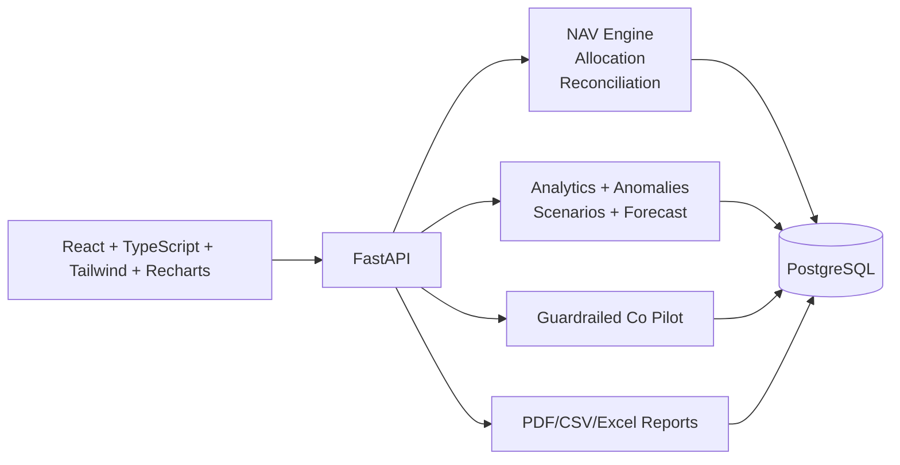

# NAVCore Platform
### Multi-Club NAV Fund Operating System (Audit-Ready + Explainable Intelligence)

NAVCore is a production-focused fintech platform for fund operators running **multiple independent investment clubs** with strict accounting controls:

- No cross-club money leakage
- Deterministic NAV math with exact reconciliation gates
- Immutable close-month snapshots
- Explainable analytics + AI Copilot in Intelligent Mode

If you are evaluating engineering quality for hiring, this project demonstrates full-stack ownership across:
**financial domain modeling, deterministic computation, risk controls, product UX, audit trails, and deployable infrastructure**.

## Why This Project Is Hard To Ignore
- Built around a real accounting truth model (not dashboard-only mock data)
- Enforces period immutability and adjustment-only corrections after close
- Uses server-side RBAC + club isolation + audit logs for every critical mutation
- Ships both operational workflow (Basic Mode) and decision support (Intelligent Mode)
- Includes deployment blueprint for Render + PostgreSQL with secrets-safe config

## Core Accounting Model
Monthly NAV for each club:

`Opening NAV + Contributions - Withdrawals + Income - Expenses = Closing NAV`

Allocation rules:

- `ownership% = investor opening balance / club opening NAV`
- income and expense allocation follow ownership%
- investor closing balance:
  `opening + net_alloc + contributions - withdrawals`
- reconciliation rule:
  `sum(investor closing balances) == club closing NAV` exactly

Closed periods are immutable. Corrections are posted as adjustments into a later open period.

## Product Modes
| Mode | Purpose | Features |
|---|---|---|
| Basic | Operational execution | Clubs, Investors, Ledger CRUD, Close Month checklist + reconciliation gate, Reports |
| Intelligent | Decision support | Insights feed, anomaly detection, scenario simulator, forecasting, allocation explainability, Co Pilot |

## High-Impact Features
### 1) Multi-Club Isolation + RBAC
- Roles: `Admin`, `Fund Accountant`, `Advisor`, `Investor`
- Club access enforced on server
- Cross-club and cross-tenant access blocked

### 2) Deterministic NAV Engine
- Decimal-safe computation (`ROUND_HALF_UP` policy)
- Reconciliation stamp:
  - `Reconciled ✅`
  - `Mismatch ❌ UGX X` (close blocked)

### 3) Close-Month Controls
- Draft -> Review -> Closed lifecycle
- Checklist gate for close action
- Immutable snapshots (`nav_snapshots`, `investor_balances`)

### 4) Audit + Export Readiness
- Audit log for create/update/delete/close actions
- PDF reports from closed snapshots
- CSV/Excel exports for regulator-friendly workflows

### 5) Intelligent Mode (Explainable)
- Insight ranking for NAV change drivers
- Anomaly detection (duplicates, outliers, backdated entries, incomplete postings, mismatch)
- Scenario simulator (best/base/worst band + goal contribution calculator)
- Forecasting (rolling average + linear regression with confidence band)
- Allocation explainability panel for investor-level decomposition

### 6) AI Co Pilot (Guardrailed)
- Read-only by default
- Strictly scoped to selected `club + period`
- Cites sources in UI (`period_id`, `snapshot_id`, transaction references)
- Refuses mutation requests and closed-period tampering

## Architecture


## Tech Stack
- Frontend: React, TypeScript, Vite, Tailwind, Recharts
- Backend: FastAPI, SQLAlchemy, Alembic
- Database: PostgreSQL
- Testing: Pytest
- Reporting: ReportLab + OpenPyXL
- AI: Gemini API (via server-side guarded endpoint)

## Repository Structure
```text
.
├─ src/                  # Frontend app
├─ backend/
│  ├─ app/               # FastAPI app (routes, models, services)
│  ├─ alembic/           # Migrations
│  ├─ tests/             # Unit/integration tests
│  ├─ scripts/           # Synthetic data seeding
│  └─ docs/              # Security/audit/deployment notes
├─ render.yaml           # Render deployment blueprint
└─ README.md
```

## Local Run (Windows)
### 1) Frontend
```powershell
npm ci
npm run dev -- --host 127.0.0.1 --port 5173
```

### 2) Backend
```powershell
cd backend
C:\Users\USER\AppData\Local\Programs\Python\Python312\python.exe -m pip install -r requirements.txt
C:\Users\USER\AppData\Local\Programs\Python\Python312\python.exe -m uvicorn app.main:app --host 127.0.0.1 --port 8000
```

### 3) Seed synthetic data (optional)
```powershell
cd backend
$env:PYTHONPATH='.'
C:\Users\USER\AppData\Local\Programs\Python\Python312\python.exe scripts/seed_synthetic_data.py
```

## Testing
```powershell
cd backend
C:\Users\USER\AppData\Local\Programs\Python\Python312\python.exe -m pytest -q
```

## Deploy on Render (Blueprint)
This repository includes `render.yaml` for one-click infrastructure provisioning:

- `navcore-api` (FastAPI web service)
- `navcore-web` (static frontend)
- `navcore-postgres` (managed PostgreSQL)

### Render steps
1. Push this repo to GitHub.
2. In Render, choose **Blueprint** and select this repo.
3. Create stack.
4. Set required secret env vars in Render:
   - `GEMINI_API_KEY` (secret)
5. Confirm backend `CORS_ORIGINS` matches frontend URL.

## Security Notes (Important)
- API keys are **not** committed in repository config.
- Local secret files (`.env`, `backend/.env`) are gitignored.
- Keep all secrets in Render environment variables / secret manager.

## Key API Endpoints
- Clubs/Investors/Memberships CRUD
- Period state + status transitions
- Ledger CRUD + bulk import
- NAV preview / close / snapshot
- Reconciliation checks
- Analytics:
  - `/analytics/metrics`
  - `/analytics/insights`
  - `/analytics/anomalies`
  - `/analytics/scenarios`
  - `/analytics/forecast`
- Co Pilot:
  - `/copilot/chat`

## Employer Snapshot: What This Demonstrates
- Translating financial policy into strict backend invariants
- Designing for correctness first, then UX and explainability
- Handling immutable snapshots + mutable drafts safely
- Shipping a dual-mode product with role-aware capabilities
- Delivering deployable DevOps artifacts, not just app code

---
If you are a hiring manager or tech lead, this repo is intentionally built to show **production-minded fintech engineering** rather than demo-only UI work.
